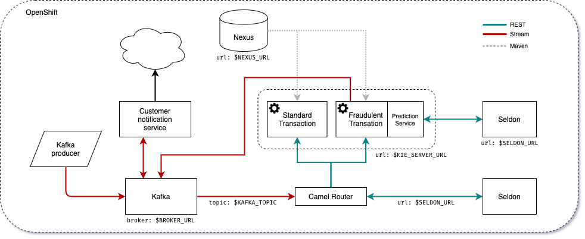
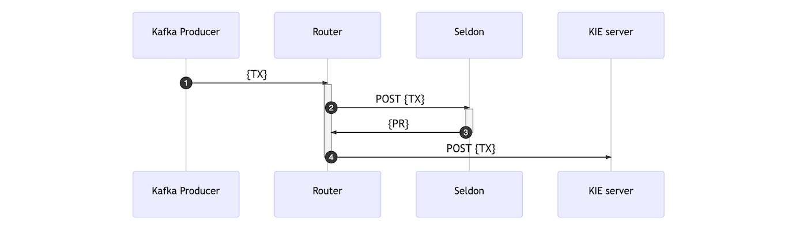
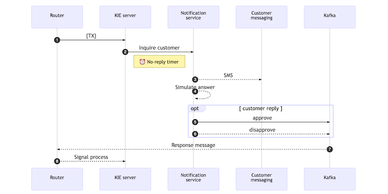
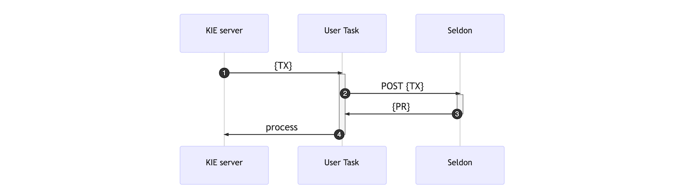
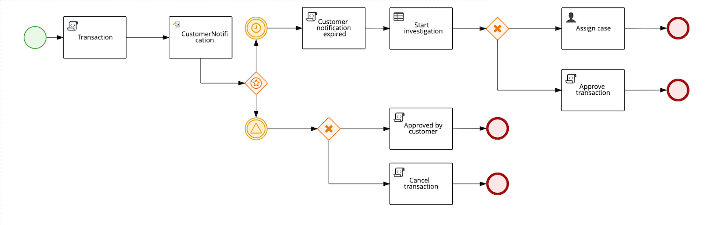

# CCFD demo



## Contents

- [CCFD demo](#ccfd-demo)
  - [Contents](#contents)
  - [Setup](#setup)
    - [Running on OpenShift](#running-on-openshift)
      - [OpenDataHub](#opendatahub)
      - [Kafka](#kafka)
      - [Rook / Ceph](#rook--ceph)
        - [Route](#route)
      - [Fraud detection model](#fraud-detection-model)
      - [Upload data to Rook-Ceph](#upload-data-to-rook-ceph)
      - [Kie server](#kie-server)
        - [Execution server](#execution-server)
          - [Execution server optional configuration](#execution-server-optional-configuration)
      - [Notification service](#notification-service)
      - [Camel router](#camel-router)
      - [Kafka producer](#kafka-producer)
      - [Prometheus / Grafana](#prometheus--grafana)
  - [Description](#description)
    - [Events](#events)
      - [Incoming transactions](#incoming-transactions)
      - [Notifications](#notifications)
      - [jBPM prediction service](#jbpm-prediction-service)
    - [Business processes](#business-processes)
  - [Footnotes](#footnotes)

## Setup

### Running on OpenShift

To deploy all the components in OpenShift, the simplest way is to login using `oc`, e.g.:

```shell
$ oc login -u <USER>
```

Next you can create a project for this demo, such as

```shell
$ oc new-project ccfd
```

#### OpenDataHub

We start by installing OpenDataHub via its operator. Start by cloning the operator:

```shell
$ git clone https://gitlab.com/opendatahub/opendatahub-operator
$ cd opendatahub-operator
```

Next, we deploy ODH and Seldon's CRD. [^0]

```shell
$ oc create -f deploy/crds/opendatahub_v1alpha1_opendatahub_crd.yaml
$ oc create -f deploy/crds/seldon-deployment-crd.yaml
```

Next, create the services and RBAC policy for the service account the operator will run as. This step at a minimum requires namespace admin rights.

```shell
$ oc create -f deploy/service_account.yaml
$ oc create -f deploy/role.yaml
$ oc create -f deploy/role_binding.yaml
$ oc adm policy add-role-to-user admin -z opendatahub-operator
```

Now we can deploy the operator with:

```shell
$ oc create -f deploy/operator.yaml
```

And wait before the pods are ready before continuing. You can verify using:

```shell
$ oc get pods
```

#### Kafka

[Strimzi](https://strimzi.io/) is used to provide Apache Kafka on OpenShift.
Start by making a copy of `deploy/crds/opendatahub_v1alpha1_opendatahub_cr.yaml`, *e.g.*

```shell
$ cp deploy/crds/opendatahub_v1alpha1_opendatahub_cr.yaml frauddetection_cr.yaml
```

and edit the following values:

```yaml
# Seldon Deployment
seldon:
odh_deploy: true

kafka:
odh_deploy: true
kafka_cluster_name: odh-message-bus
kafka_broker_replicas: 3
kafka_zookeeper_replicas: 3
```

Kafka installation requires special setup, the following steps are to configure Kafka. Add your username to the `kafka_admins` list,
by editing `deploy/kafka/vars/vars.yaml`:

```yaml
kafka_admins:
- admin
- system:serviceaccount:{{ NAMESPACE }}:opendatahub-operator
- <INSERT USERNAME>
```

You can now deploy Kafka using:

```shell
$ cd deploy/kafka/
$ pipenv install
$ pipenv run ansible-playbook deploy_kafka_operator.yaml -e kubeconfig=$HOME/.kube/config -e NAMESPACE=<namespace>
```

Deploy the ODH custom resource based on the sample template

```shell
$ oc create -f frauddetection_cr.yaml
```

#### Rook / Ceph

This installation of Rook-Ceph assumes your OCP 3.11/4.x cluster has at least 3 worker nodes.
Download the files for Rook Ceph v0.9.3 and modify the source Rook Ceph files directly, clone the Rook operator and checkout the v0.9.3 branch.  For convenience we also included the modified files.

```shell
$ git clone https://github.com/rook/rook.git
$ cd rook
$ git checkout -b rook-0.9.3 v0.9.3
$ cd cluster/examples/kubernetes/ceph/
```

Edit `operator.yaml` and set the environment variables for `FLEXVOLUME_DIR_PATH` and `ROOK_HOSTPATH_REQUIRES_PRIVILEGED` to allow the Rook operator to use OpenShift hostpath storage.

```yaml
name: FLEXVOLUME_DIR_PATH
value: "/etc/kubernetes/kubelet-plugins/volume/exec"
name: ROOK_HOSTPATH_REQUIRES_PRIVILEGED
value: "true"
```

The following steps require cluster wide permissions. Configure the necessary security contexts , and deploy the rook operator, this will create a new namespace, `rook-ceph-system`, and deploy the pods in it.

```shell
$ oc create -f scc.yaml         # configure security context
$ oc create -f operator.yaml    # deploy operator
```

You can verify deployment is ongoing with:

```shell
$ oc get pods -n rook-ceph-system
NAME READY STATUS RESTARTS AGE
rook-ceph-agent-j4zms 1/1 Running 0 33m
rook-ceph-agent-qghgc 1/1 Running 0 33m
rook-ceph-agent-tjzv6 1/1 Running 0 33m
rook-ceph-operator-567f8cbb6-f5rsj 1/1 Running 0 33m
rook-discover-gghsw 1/1 Running 0 33m
rook-discover-jd226 1/1 Running 0 33m
rook-discover-lgfrx 1/1 Running 0 33m
```

Once the operator is ready, you can create a Ceph cluster, and a Ceph object service.
The toolbox service is also handy to deploy for checking the health of the Ceph cluster.
This step takes a couple of minutes, please be patient.

```shell
$ oc create -f cluster.yaml
```

Check the pods and wait for this pods to finish before proceeding.

```shell
$ oc get pods -n rook-ceph
rook-ceph-mgr-a-66db78887f-5pt7l              1/1     Running     0          108s
rook-ceph-mon-a-69c8b55966-mtb47              1/1     Running     0          3m19s
rook-ceph-mon-b-59699948-4zszh                1/1     Running     0          2m44s
rook-ceph-mon-c-58f4744f76-r8prn              1/1     Running     0          2m11s
rook-ceph-osd-0-764bbd9694-nxjpz              1/1     Running     0          75s
rook-ceph-osd-1-85c8df76d7-5bdr7              1/1     Running     0          74s
rook-ceph-osd-2-8564b87d6c-lcjx2              1/1     Running     0          74s
rook-ceph-osd-prepare-ip-10-0-136-154-mzf66   0/2     Completed   0          87s
rook-ceph-osd-prepare-ip-10-0-153-32-prf94    0/2     Completed   0          87s
rook-ceph-osd-prepare-ip-10-0-175-183-xt4jm   0/2     Completed   0          87s
```

Edit `object.yaml` and replace port `80` with `8080`:

```yaml
gateway:
# type of the gateway (s3)
type: s3
# A reference to the secret in the rook namespace where the ssl certificate is stored
sslCertificateRef:
# The port that RGW pods will listen on (http)
port: 8080
```

And then run:

```shell
$ oc create -f toolbox.yaml
$ oc create -f object.yaml
```

You can check the deployment progress, as previously, with:

```shell
$ oc get pods -n rook-ceph
rook-ceph-mgr-a-5b6fcf7c6-cx676 1/1 Running 0 6m56s
rook-ceph-mon-a-54d9bc6c97-kvfv6 1/1 Running 0 8m38s
rook-ceph-mon-b-74699bf79f-2xlzz 1/1 Running 0 8m22s
rook-ceph-mon-c-5c54856487-769fx 1/1 Running 0 7m47s
rook-ceph-osd-0-7f4c45fbcd-7g8hr 1/1 Running 0 6m16s
rook-ceph-osd-1-55855bf495-dlfpf 1/1 Running 0 6m15s
rook-ceph-osd-2-776c77657c-sgf5n 1/1 Running 0 6m12s
rook-ceph-osd-3-97548cc45-4xm4q 1/1 Running 0 5m58s
rook-ceph-osd-prepare-ip-10-0-138-84-gc26q 0/2 Completed 0 6m29s
rook-ceph-osd-prepare-ip-10-0-141-184-9bmdt 0/2 Completed 0 6m29s
rook-ceph-osd-prepare-ip-10-0-149-16-nh4tm 0/2 Completed 0 6m29s
rook-ceph-osd-prepare-ip-10-0-173-174-mzzhq 0/2 Completed 0 6m28s
rook-ceph-rgw-my-store-d6946dcf-q8k69 1/1 Running 0 5m33s
rook-ceph-tools-cb5655595-4g4b2 1/1 Running 0 8m46s
```

Next, you will need to create a set of S3 credentials, the resulting credentials will be stored in a secret file under the rook-ceph namespace.
There isn’t currently a way to cross-share secrets between OpenShift namespaces, so you will need to copy the secret to the namespace running Open Data Hub operator. To do so, run:

```shell
$ oc create -f object-user.yaml
```

Next we are going to retrieve the secrets using

```shell
$ oc get secrets -n rook-ceph rook-ceph-object-user-my-store-my-user -o json
```

Create a secret in your deployment namespace that includes the secret and key for S3 interface. 
Make sure to copy the accesskey and secretkey from the command output above and download the secret yaml file
available in this repo in `deploy/ceph/s3-secretceph.yml`.

```shell
$ oc create -n ccfd -f deploy/ceph/s3-secretceph.yaml
```

##### Route

From the Openshift console, create a route to the rook service, `rook-ceph-rgw-my-store`, in the `rook-ceph` namespace to expose the endpoint. This endpoint url will be used to access the S3 interface from the example notebooks.

```shell
$ oc expose -n rook-ceph svc/rook-ceph-rgw-my-store
```

#### Fraud detection model

Deploy fraud detection fully trained model by using `deploy/model/modelfull.json` in this repository:

```shell
$ oc create -n ccfd -f deploy/model/modelfull.json
```

Check and make sure the model is created, this step will take a couple of minutes.

```shell
$ oc get seldondeployments
$ oc get pods
```

Create a route to the model by using `deploy/model/modelfull-route.yaml` in this repo:

```shell
$ oc create -n ccfd -f deploy/model/modelfull-route.yaml
```

Enable Prometheus metric scraping by editing `modelfull-modelfull` service from the portal and adding these two lines under annotations:

```yaml
apiVersion: v1
kind: Service
metadata:
annotations:
prometheus.io/path: /prometheus
prometheus.io/scrape: 'true'
```

#### Upload data to Rook-Ceph

Make sure to decode the key and secret copied from the rook installation by using the following commands:

```shell
$ base64 -d
<Paste secret>
[Ctrl-D]
```

From a command line use the `aws` tool to upload the file to `rook-ceph` data store:

```shell
$ aws configure
```

Only enter key and secret, leave all other fields as default. Check if connection is working using the route
[created previously](#route):

```shell
$ aws s3 ls --endpoint-url <ROOK_CEPH_URL>
```

Create a bucket and upload the file:

```shell
$ aws s3api create-bucket --bucket ccdata --endpoint-url <ROOK_CEPH_URL>
```

Download the credit card transaction `creditcard.csv` file (available [here](https://gitlab.com/opendatahub/fraud-detection-tutorial/-/raw/master/data/creditcard.csv)) and upload it using:

```shell
$ wget -O creditcard.csv https://gitlab.com/opendatahub/fraud-detection-tutorial/-/raw/master/data/creditcard.csv
$ aws s3 cp creditcard.csv s3://ccdata/OPEN/uploaded/creditcard.csv --endpoint-url <ROOK_CEPH_URL> --acl public-read-write
```

You can verify the file is uploaded using:

```shell
$ aws s3 ls s3://ccdata/OPEN/uploaded/ --endpoint-url <ROOK_CEPH_URL>
```

#### Kie server

##### Execution server

To deploy the KIE server, the container image `ruivieira/ccd-service` can be used (located [here](https://hub.docker.com/repository/docker/ruivieira/ccd-service)),  deploying it with:

```shell
$ oc new-app ruivieira/ccd-service:1.0-SNAPSHOT \
    -e SELDON_URL=ccfd-seldon-model:5000 \
    -e NEXUS_URL=http://nexus:8081 \
    -e CUSTOMER_NOTIFICATION_TOPIC=ccd-customer-outgoing \
    -e BROKER_URL=odh-message-bus-kafka-brokers:9092
```

###### Execution server optional configuration

If the Seldon server requires an authentication token, this can be passed to the KIE server by adding the following environment variable:

```shell
-e SELDON_TOKEN=<SELDON_TOKEN>
```

By default, the KIE server will request a prediction to the endpoint `<SELDON_URL>/predict`. If however, your Seldon deployment uses another prediction endpoint, you can specify it by adding the `SELDON_ENDPOINT` enviroment variable above, for instance:

```shell
-e SELDON_ENDPOINT=api/v0.1/predictions
```

The HTTP connection parameters can also be configured, namely the _connection pool size_ and the connections _timeout_. The timeout value provided is treated as milliseconds. For instance:

```shell
-e SELDON_TIMEOUT=5000 \ # five second timeout
-e SELDON_POOL_SIZE=5    # allows for 5 simulataneous HTTP connections
```

The prediction service's _confidence threshold_, above which a prediction automatically assigns an output and
closes the user task can be also provided. It is assumed to be a probability value between `0.0` and `1.0`.
If not provided, the default value is `1.0`. To specify it use:

```shell
-e CONFIDENCE_THRESHOLD=0.5 # as an example
```

If you want to interact with the KIE server's REST interface from outside OpenShift, you can expose its service with

```shell
$ oc expose svc/ccd-service
```

#### Notification service

The notification service is an event-driven micro-service responsible for relaying notifications to the customer and customer responses. 

If a message is sent to a "customer outgoing" Kafka topic, a notification is sent to the customer asking whether the transaction was legitimate or not. For this demo, the micro-service simulates customer interaction, but different communication methods can be built on top of it (email, SMS, *etc*).

If the customer replies (in both scenarios: they either made the transaction or not), a message is written to a "customer response" topic. The router (described below) subscribes to messages in this topic, and signals the business process with the customer response.

To deploy the notification service, we use the image `ruivieira/ccfd-notification-service` (available [here](https://hub.docker.com/repository/docker/ruivieira/ccfd-notification-service)), by running:

```shell
$ oc new-app ruivieira/ccfd-notification-service:1.0-SNAPSHOT \
    -e BROKER_URL=odh-message-bus-kafka-brokers:9092
```

#### Camel router

The Camel router is responsible consume messages arriving in specific topics, requesting a prediction to the Seldon model, and then triggering different REST endpoints according to that prediction.
The route is selected depending on whether a transaction is predicted as fraudulent or not. Depending on the model's prediction a specific business process will be triggered on the KIE server.
To deploy a router with listens to the topic `KAFKA_TOPIC` from Kafka's broker `BROKER_URL` and starts a process instance on the KIE server at `KIE_SERVER_URL`, we can use the built image `ruimvieira/ccd-fuse` (available [here](https://hub.docker.com/repository/docker/ruivieira/ccd-fuse)):

```shell
$ oc new-app ruivieira/ccd-fuse:1.0-SNAPSHOT \
    -e BROKER_URL=odh-message-bus-kafka-brokers:9092 \
    -e KAFKA_TOPIC=odh-demo \
    -e KIE_SERVER_URL=http://ccd-service:8090 \
    -e SELDON_URL=http://modelfull-modelfull:8000 \
    -e CUSTOMER_NOTIFICATION_TOPIC=ccd-customer-outgoing \
    -e CUSTOMER_RESPONSE_TOPIC=ccd-customer-response \
    -e SELDON_ENDPOINT=api/v0.1/predictions
```

Also optionally, a Seldon token can be provided:

```shell
-e SELDON_TOKEN=<SELDON_TOKEN>
```

By default, the router will request a prediction to the endpoint `<SELDON_URL>/api/v0.1/predictions`. If however, your Seldon deployment uses another prediction endpoint, you can specify it by adding the `SELDON_ENDPOINT` enviroment variable above, for instance:

```shell
-e SELDON_ENDPOINT=predict
```

#### Kafka producer

The Kafka Producer needs specific parameters to read from S3 interface and call the model's REST prediction endpoint.
Edit `deploy/kafka/ProducerDeployment.yaml` in this repository. Edit the file to specify namespace and your `rook-ceph` URL, your bucket name (this need to point to the location of the `creditcard.csv` file in the `rook-ceph` data store).

```yaml
- name: NAMESPACE
  description: The OpenShift project in use
  value: <PROJECT> # e.g. ccfd

- name: s3endpoint
  value: "<ROOK_CEPH_URL>:443"

- name: s3bucket
  value: "ccdata"

- name: filename
  value: "OPEN/uploaded/creditcard.csv"
```

Create the producer pod with:

```shell
$ oc process -f deploy/kafka/ProducerDeployment.yaml | oc apply -f -
```

#### Prometheus / Grafana

From the Openshift portal click on the Prometheus route and explore some of the metrics.
To launch Grafana dashboard click on the Grafana route.
Use the [Grafana Boards](deploy/grafana/) and upload them to the dashboard.
The following is a list of the boards:

- [Kafka](deploy/grafana/Kafka.json)
- [Seldon Model](deploy/grafana/ModelPrediction.json)
- [Seldon Core](deploy/grafana/SeldonCore.json)
- [Spark Metrics](deploy/grafana/SparkMetrics.json)

Additional Prometheus metrics are exposed by the router at `ccd-fuse:8091/prometheus`, namely:

- `transaction.incoming`, total number of incoming transactions
- `transaction.outgoing (type=standard)`, total outgoing transactions to the "standard" business process
- `transaction.outgoing (type=fraud)`, total outgoing transactions to the "fraud" business process
- `notifications.outgoing`, the number of customers notified (via SMS, email, etc) about a potentially fraudulent transaction
- `notifications.incoming`:
  - `notifications.incoming(response=approved)`, number of customers which approved the transaction
  - `notifications.incoming(response=non_approved)`, number of customers which did not approved the transaction

## Description

### Events

#### Incoming transactions



The [Kafka producer](#kafka-producer) sends transaction data (`TX`) to the `odh-demo` topic **(1)**.
The transaction data is based on the Kaggle Credit Card Fraud dataset.
The Camel-based router reads the `odh-demo` topic for incoming transactions. Once it gets a transaction, it will extract the features needed for the model being served by Seldon. It will then issue a prediction request, via REST to the Seldon server **(2)**. This is done using an HTTP POST request with the transaction features as the payload.
The Seldon server will return a prediction probability (`PR`) on whether this is potentially a fraudulent transaction or not **(3)**.

The router will then send the data to the KIE server **(4)**. The router will instantiate a standard or fraudulent transaction business process, depending on the value returned by Seldon.

#### Notifications



When a transaction is classified as potentially fraudulent, it is sent to the KIE server, creating a "fraud" business process **(1)**.

The business process then sends a message to the Kafka topic `ccd-customer-outgoing` with the customer id, transaction details and process id **(2)**. The business process will then wait for either, whichever happens first:

- A response from the client (approving or not approving the transaction)
- A pre-defined timer runs out

The messages in the `ccd-customer-outgoing` topic trigger a notification service **(3)**. This service can be extended to inquire the customer in any preferred way (SMS, email, *etc.*), but for the purposes of this demo, we randomly generate a reply (or no reply) from the customer **(4)**.

In the case where the customer replies **(5)**/**(6)**, the notification service will publish the customer's response to the `ccd-customer-response` topic.

This response message will be picked up by the router **(7)**, which will then be redirected in order to signal the appropriate business process within the KIE server that the customer replied along with the response **(8)**.

#### jBPM prediction service



If the transaction was flagged as potentially fraudulent, the customer did not acknowleged it after a certain pre-defined period, an insvestigation branch of the business process will be triggered.
A User Task will be created and use the jBPM's prediction service API to request a outcome prediction from Seldon using REST **(2)**.

The prediction result will then be parsed by the prediction service and if the prediction confidence is:

- Above the defined threshold, automatically close the User Task, assigning the outcome returned by the ML model
- Below the defined threshold, set the prediction outcome to the most likely result, but do not close the User Task

### Business processes



The Business Process (BP) corresponding to a potential fraudulent transaction consists of the following flow:

- The process is instantiated with the transaction's data
- The `CustomerNotification` node sends a message to the `<CUSTOMER-OUTGOING>` topic with the customer's `id` and the transaction's `id`
- At this point, either one of the two branches will be active:
  - If no customer response is received, after a certain specified time, a timer will trigger this branch.
    - A DMN model is used where the outcome is to either initiate an investigation or accept the transaction.
    - For demonstration purposes, a simple rule is evaluated where:
      - If the fraud probability is below a certain threshold, and the transaction amount is sufficiently small, it is accepted.
      - If the transaction amount is large or the probability is above a certain threshold, the BP proceeds with the creation of a User Task, assigned to a fraud investigator.
  - If (before the timer expires) a response sent, the process is notified via a signal, containing the customer's response as the payload (either `true`, the customer made the transation or `false`, they did not). From here two additional branches:
    - If the customer acknowledges the transaction, it is automatically approved.
    - If not, the transaction is cancelled.

The customer notification/response works by:

- Sending a message with the customer and transaction id to `<CUSTOMER-OUTGOING>` topic
- This message is picked by the [notification service](#notification-service), which will send an approriate notification (email, SMS, *etc*) 
- Customer response is sent to the `<CUSTOMER-RESPONSE>` topic, which is picked by the Camel router, which in turn sends it to the appropriate container, using a KIE server REST endpoint, as a signal containing the customer response

## Footnotes

[^0]: Note that this step requires `cluster-admin` permissions.
[^1]: In case you need cluster admin privileges to deploy Strimzi, in which case (in a development setup)  you can run `oc adm policy add-cluster-role-to-user cluster-admin system:serviceaccount:default:strimzi-cluster-operator`.